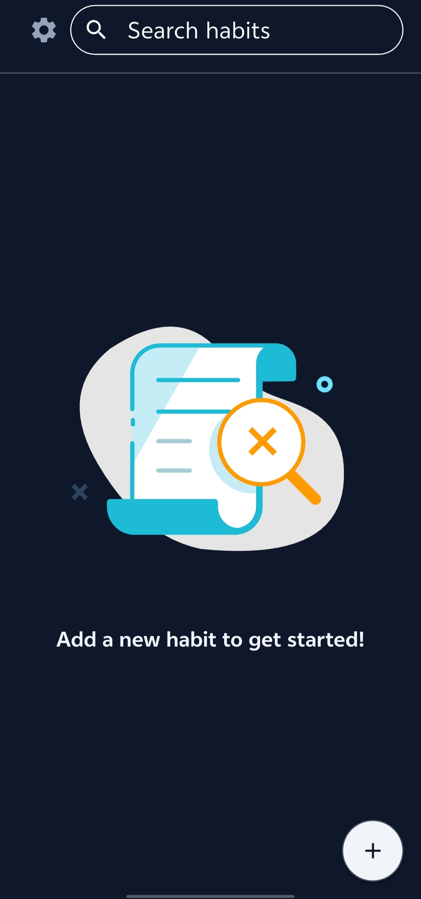

# Break Free
A simple Flutter app that helps users break from bad habits and track their progress.

## Motivation
The idea for Break Free came from app used to help me but it contains a massive amount of ads and requires purchase to remove them, so i think why not make my own version of it and that's how Break Free was born.

## Packages Used

| Package | Description |
|---------|-------------|
| [Riverpod](https://riverpod.dev) | State management |
|[Sqflite](https://pub.dev/packages/sqflite)| SQLite plugin for Flutter |
|[Freezed](https://pub.dev/packages/freezed)| Code generation for immutable classes |
|[Lottie](https://pub.dev/packages/lottie)| Render After Effects animations |
|[Flutter hooks](https://pub.dev/packages/flutter_hooks)| React hooks for Flutter |
|[GoRouter](https://pub.dev/packages/go_router)| Declarative routing for Flutter |
|[Quick Alert](https://pub.dev/packages/quickalert)| Beautiful and customizable alert dialogs |

## Preview

  
  
  
  

## Contributing
Contributions are welcome! Please open an issue or submit a pull request.